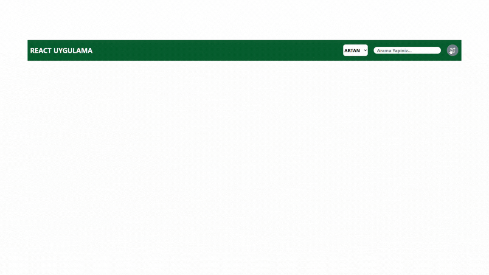

# REACT-REDUX-TOOLKIT-WORK

<h4>

React Uygulaması — Ürün Yönetim Paneli
Bu proje, kullanıcıların ürün ekleyebildiği, düzenleyebildiği, arayabildiği ve sıralayabildiği basit ama işlevsel bir React uygulamasıdır. Redux kullanılarak global state yönetimi yapılmıştır.

🚀 Kullanılan Teknolojiler:
React – Arayüzün oluşturulması

Redux Toolkit – Global state yönetimi

React Router – Sayfa yönlendirme

Tailwind CSS – Hızlı ve özelleştirilebilir stil

Yerel Depolama (localStorage) – Verilerin kalıcı saklanması

🧩 Uygulamanın Temel Özellikleri:
📦 Ürün Ekleme: Kullanıcı, ürün ismi, fiyatı ve resmi ile yeni ürünler ekleyebilir.

✏️ Ürün Güncelleme: Mevcut ürün üzerinde düzenleme yapılabilir.

❌ Ürün Silme: İstenmeyen ürünler kaldırılabilir.

🔍 Arama (Filtreleme): Kullanıcı, ürün ismine göre anlık olarak filtreleme yapabilir.

🔃 Sıralama: Fiyat bilgisine göre "artan" ve "azalan" şekilde sıralama yapılabilir.

📁 Fotoğraf Önizlemesi: Yüklenen görsel ürün kartında önizlenebilir.

📦 Modal Kullanımı: Ürün ekleme/güncelleme işlemleri modal üzerinden yapılmaktadır.

🎯 Hedef:
Bu projede, temel CRUD işlemleri ve kullanıcı dostu arayüz oluşturularak, modern web uygulaması geliştirme becerilerimi pekiştirdim. Aynı zamanda Redux kullanarak daha büyük ölçekli uygulamalarda state yönetimini nasıl daha okunabilir ve yönetilebilir hale getirebileceğimi deneyimledim.

</h4>

<h5>Gif Dökümasyonu :</h5>

